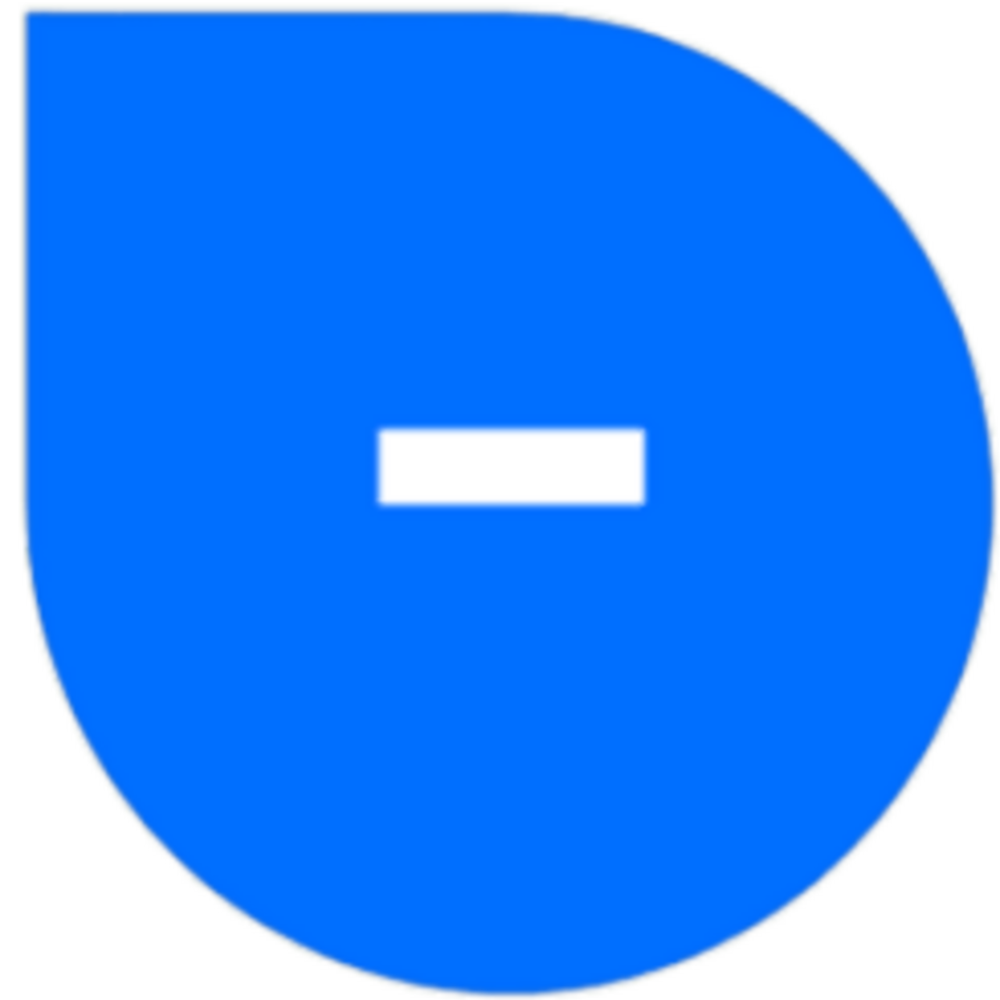

# MinusBounce                                  

### Info: [Discord](https://discord.gg/qYSCCmsgBe)

# Getting Started

### Prerequisites

- [Git](https://git-scm.com/)
- [Minecraft 1.8.9](https://www.minecraft.net/)
- And a text editor like VSCode, SublimeText, Notepad, ... :trollface:

### Developement

1. Clone the repository:

    ```bash
    git clone https://github.com/MinusMCNetwork/MinusBouce.git
    ```
   
2. Navigate to the project directory:

    ```bash
    cd MinusBounce
    ```

3. Depending on which IDE you are using execute either of the following commands:
   - For IntelliJ: `gradlew setupDevWorkspace idea genIntellijRuns build`
   - For Eclipse: `gradlew setupDevWorkspace eclipse build`


